# LoRAForge

A native macOS and iPadOS application for generating, curating, and captioning character-LoRA training datasets.

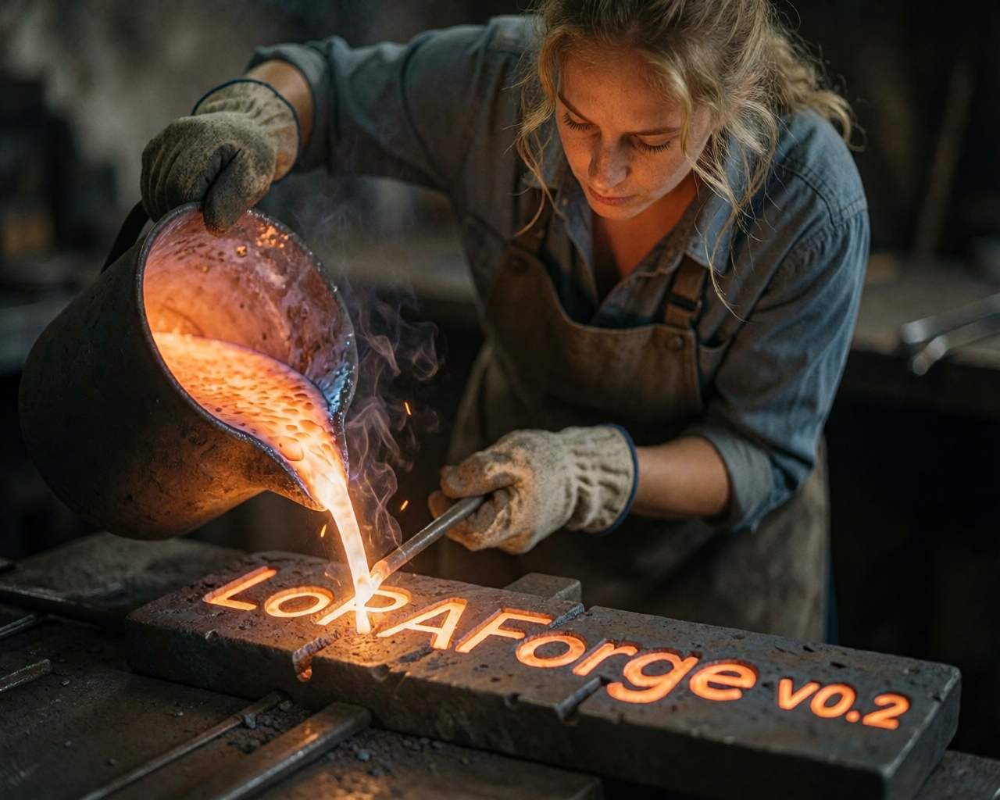

## Overview

LoRAForge provides a complete workflow for building high-quality LoRA training datasets. It connects to a [Draw Things](https://drawthings.ai) server for image generation and optionally to [Ollama](https://ollama.com) for AI-powered captioning, letting you go from prompt to export-ready dataset in a single app.

Images are generated from configurable prompts, ranked through a four-tier curation system, then tagged and captioned using a structured category-based tagging system that renders captions automatically. Finished datasets export as image + sidecar-text pairs ready for LoRA training.

Projects are stored as `.loraforge` bundles in a managed library. The app autosaves continuously, and generation results route to the correct project automatically — even if it is not the one currently selected.

## Features

- **Draw Things integration** — Generate images via a Draw Things gRPC server with full configuration control, including LoRAs, ControlNets, samplers, and more
- **Four-tier image ranking** — Curate generated images through candidate, shortlisted, final, and discarded tiers
- **Structured tagging system** — Category-based tag library with automatic caption rendering, prefix support, and separator control
- **Manual and AI-powered captioning** — Edit captions directly or auto-caption via Ollama; lock captions to freeze them and track drift
- **Reference image management** — Import reference images and attach them to prompts for img2img or ControlNet workflows
- **Prompt templates** — Save and load prompt sets as reusable templates across projects
- **Configuration presets** — Per-prompt configuration overrides with a full JSON editor
- **Dataset export** — Export image + caption (.txt) pairs with optional resizing, filename prefixes, and rank filtering
- **Dataset auditing** — Tag coverage analysis across your dataset to identify gaps before training
- **Legacy import** — Import v1 projects (`.lforge`) into the new `.loraforge` format

## Screenshots

| Dataset Builder | Caption Editor |
|:---:|:---:|
| 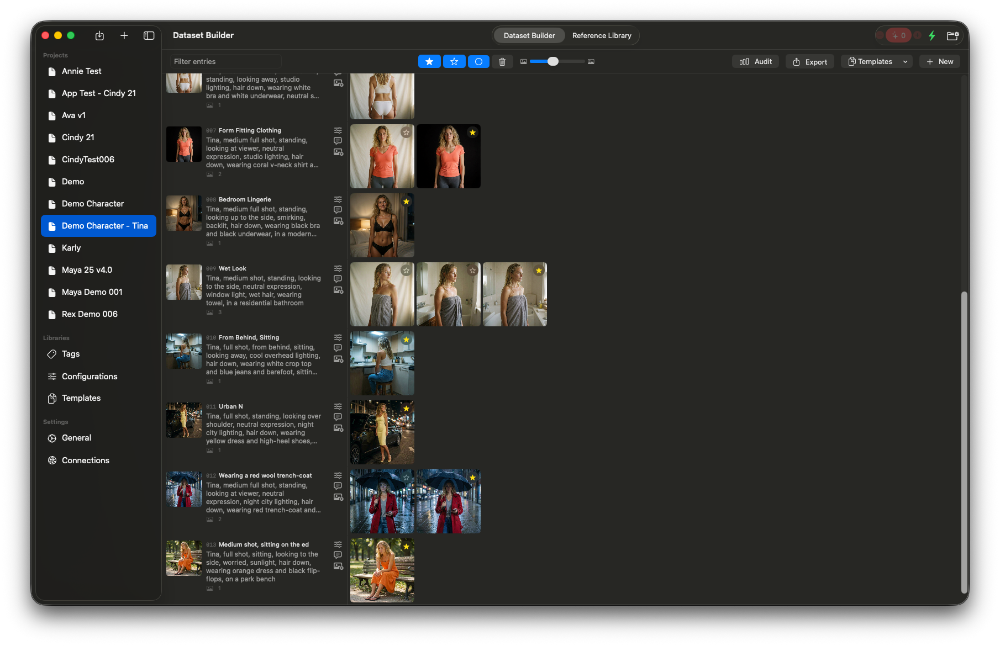 *Dataset Builder — generate, rank, and curate images* | 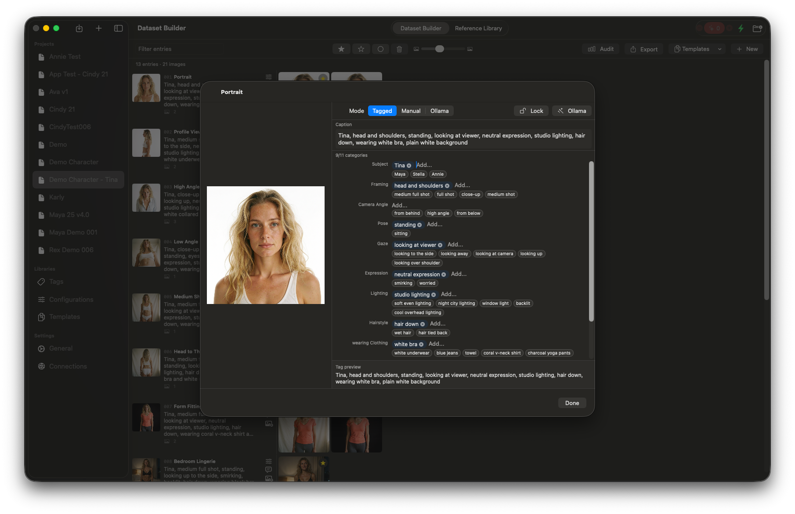 *Caption Editor — structured tagging with live preview* |

| Tag Library | Reference Library |
|:---:|:---:|
| 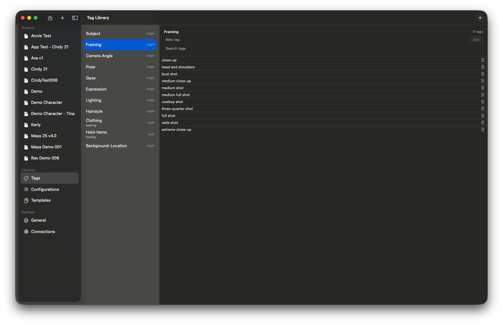 *Tag Library — manage categories and tags across all projects* | 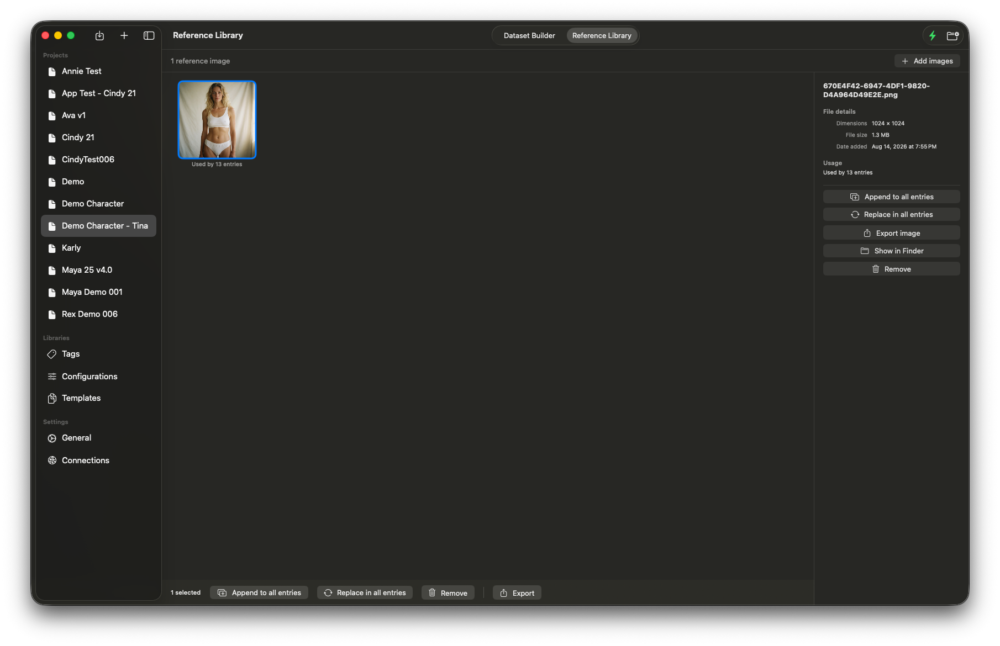 *Reference Library — organize source images for generation* |

| Tag Audit |
|:---:|
| 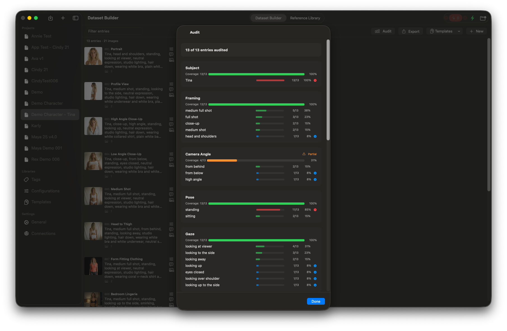 *Tag Audit — visualize tag coverage across categories to find gaps before training* |

## Requirements

- macOS 15.0 or later / iPadOS 18.0 or later
- [Draw Things](https://drawthings.ai) running with gRPC server enabled (for image generation)
- [Ollama](https://ollama.com) running locally (optional, for AI-powered captioning)
- Xcode 16 or later (to build from source)

## Getting started

1. Clone this repository and open `LoRAForge.xcodeproj` in Xcode.
2. Let Swift Package Manager resolve dependencies.
3. Build and run.
4. Enable the API Server in Draw Things (see below).
5. Connect to the server from the Connections settings in LoRAForge.
6. Create a project from the sidebar and start adding prompts.

## Connecting to Draw Things

LoRAForge communicates with Draw Things over its gRPC API server. In Draw Things, open the API Server panel and toggle it to **Server Online**.

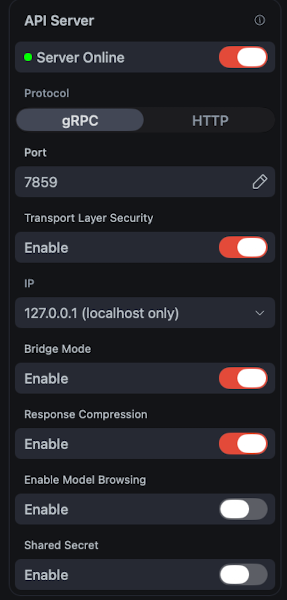

LoRAForge supports all of the optional server settings — **Transport Layer Security**, **Response Compression**, and **Shared Secret** — as long as the same options are enabled in both apps. To use DT+ features, set **Bridge Mode** to Enable.

### Connection settings

In LoRAForge, open **Connections** from the sidebar to configure your Draw Things and Ollama connections. You can save multiple server profiles and switch between them. The active connection shows its status and queue depth. Enable **Auto-connect on launch** to reconnect automatically when the app starts.

Ollama profiles specify an endpoint, model, and instruction prompt for AI-powered captioning.

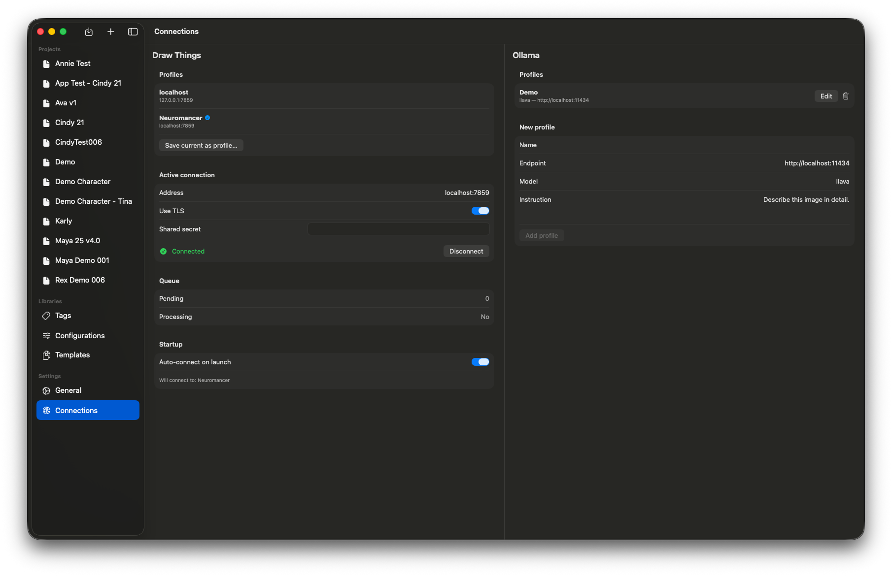

### General settings

The General settings show your library folder location and project count. You can reveal the library in Finder or change its location.

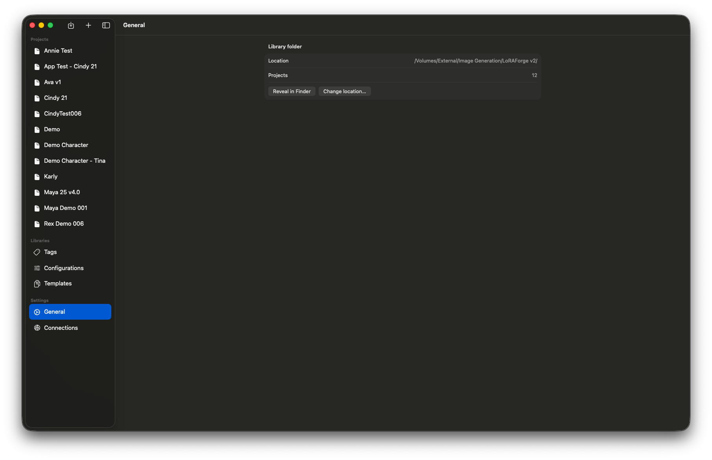

## Configuring generation settings

LoRAForge uses Draw Things generation configurations to control how images are generated. To set up a configuration:

1. **Copy from Draw Things** — Open your model settings in Draw Things, tap the `···` menu, and choose **Copy Configuration**.

   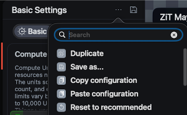

2. **Create a preset in LoRAForge** — Open the Config Library from the sidebar, create a new preset, and paste the configuration into the JSON editor. Presets can be loaded into any project's default configuration or applied per-prompt.

   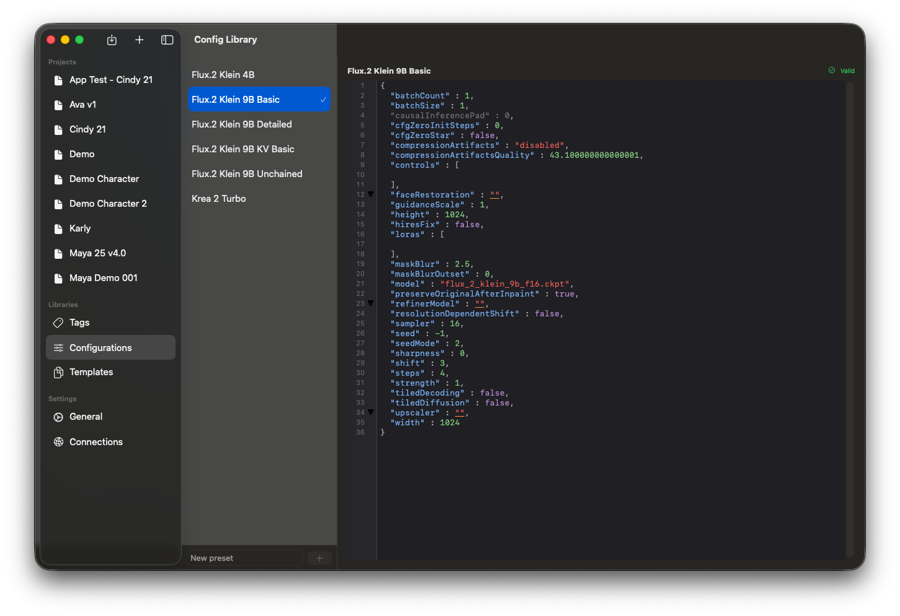

## Project settings

Each project has its own settings, accessible from the toolbar. Project settings control the project name, which tag categories are enabled, their display order, and the default generation configuration.

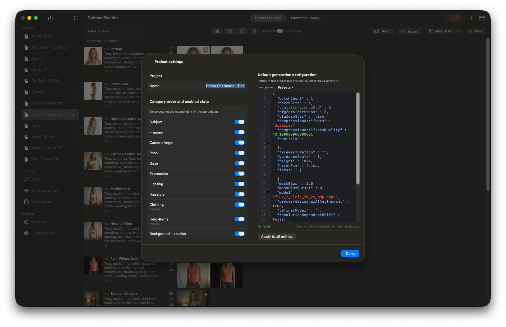

- **Category order and enabled state** — Reorder categories by dragging and toggle them on or off per-project. These settings are independent of the app-wide defaults, so each project can use a different subset of categories.
- **Default generation configuration** — Set the generation config that new entries inherit. You can load a saved preset from the Config Library or edit the JSON directly. The editor validates the JSON and shows whether the current configuration is valid.
- **Apply to all entries** — Push the current default configuration to every existing entry in the project at once. This is useful when you change models or settings mid-project and want all entries to match.

## Demo project

A complete example project is included in the [`Example Project`](Example%20Project/) folder. Download **Demo Character - Tina.loraforge.zip** and import it into LoRAForge to see a fully built-out project — this is the project shown in the screenshots above.

The demo will populate the app with basic category tags and demonstrates the end-to-end workflow:

1. A reference image was imported to the Reference Library and attached to all prompts — equivalent to placing it on the Moodboard in Draw Things.
2. A Flux.2 Klein KV 9B configuration preset was used across all 13 entries.
3. Images were generated in batches, then ranked — most candidates were discarded or re-generated until each entry had a suitable final image.
4. Final images were captioned using the structured tagging system in the Caption Editor. For each category row, you can search for existing tags or add new ones in the "Add.." field. The app learns from your projects and suggests your most commonly used tags first.
5. The Audit panel was used to check tag distribution across categories, making it easy to spot entries where a category was missed.

## How it works

1. **Set up a configuration** — Copy a generation configuration from Draw Things and save it as a preset in the Config Library. Load it as the project default or apply it per-prompt.
2. **Create a project** — Projects live in the app's managed library. Each is a self-contained `.loraforge` bundle.
3. **Import references** — Add reference images to the Reference Library and attach them to prompts. This works the same as the Moodboard in Draw Things.
4. **Add prompts** — Write prompt text, attach reference images, and optionally override the generation config per-prompt. Use templates to reuse prompt sets across projects.
5. **Generate images** — Send prompts to a Draw Things server. Results arrive asynchronously and are stored in the project bundle automatically.
6. **Curate** — Review generated images and rank them: promote good candidates through shortlisted to final, discard the rest. Re-generate as needed until you have the images you want.
7. **Tag and caption** — Assign tags from the structured tag library in the Caption Editor. Captions render automatically from your tags, or write them manually. The app suggests frequently used tags and you can search or add new ones inline. Use Ollama for AI-assisted captioning.
8. **Audit** — Check tag coverage across your final images to ensure consistent representation before training. Use this to find categories you may have missed on specific entries.
9. **Export** — Export final images with their caption sidecars as training-ready pairs.

## Dependencies

- [DrawThingsQueue](https://github.com/euphoriacyberware-ai/DrawThingsQueue) — FIFO queue management for Draw Things image generation
- [DTConfigEditorKit](https://github.com/euphoriacyberware-ai/DTConfigEditorKit) — JSON editor for Draw Things generation configurations

## License

Copyright Euphoria Cyberware AI. All rights reserved.
